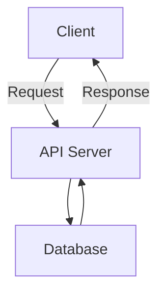

# Doorstep Stitching API Documentation

## Overview

This API provides endpoints for managing products, categories, fabrics, addresses, orders, user details, and agent orders for the Doorstep Stitching application.

## Base URL

```
https://apnadarzi-5.onrender.com
```

## Authentication

Some endpoints may require authentication. Ensure to include the necessary headers if required.

## Endpoints

### Products

#### Get All Products

- **URL:** `/api/v1/products`
- **Method:** `GET`
- **Response:**
  - **Status:** `200 OK`
  - **Body:** Array of product objects

#### Get Product by ID

- **URL:** `/api/v1/products/:id`
- **Method:** `GET`
- **Response:**
  - **Status:** `200 OK`
  - **Body:** Product object

### Categories

#### Get All Categories

- **URL:** `/api/v1/category`
- **Method:** `GET`
- **Response:**
  - **Status:** `200 OK`
  - **Body:** Array of category objects

### Fabrics

#### Get All Fabrics

- **URL:** `/api/v1/fabric`
- **Method:** `GET`
- **Response:**
  - **Status:** `200 OK`
  - **Body:** Array of fabric objects

### Addresses

#### Add Address

- **URL:** `/api/v1/address`
- **Method:** `POST`
- **Request:**
  - **Headers:** `Content-Type: application/json`
  - **Body:**
    ```json
    {
      "name": "string",
      "address1": "string",
      "address2": "string",
      "pincode": "string",
      "userID": "string"
    }
    ```
- **Response:**
  - **Status:** `201 Created`
  - **Body:** Address object

#### Get Addresses

- **URL:** `/api/v1/address`
- **Method:** `GET`
- **Response:**
  - **Status:** `200 OK`
  - **Body:** Array of address objects

### Orders

#### Create Order

- **URL:** `/orders`
- **Method:** `POST`
- **Request:**
  - **Headers:** `Content-Type: application/json`
  - **Body:**
    ```json
    {
      "userID": "string",
      "items": [
        {
          "productID": "string",
          "quantity": "number"
        }
      ],
      "totalPrice": "number"
    }
    ```
- **Response:**
  - **Status:** `201 Created`
  - **Body:** Order object

### Users

#### Register User

- **URL:** `/api/register`
- **Method:** `POST`
- **Request:**
  - **Headers:** `Content-Type: application/json`
  - **Body:**
    ```json
    {
      "phoneNumber": "string",
      "otp": "string"
    }
    ```
- **Response:**
  - **Status:** `201 Created`
  - **Body:** User object

### Cart

#### Add to Cart

- **URL:** `/api/v1/cart`
- **Method:** `POST`
- **Request:**
  - **Headers:** `Content-Type: application/json`
  - **Body:**
    ```json
    {
      "userID": "string",
      "productId": "string"
    }
    ```
- **Response:**
  - **Status:** `201 Created`
  - **Body:** Cart object

### Agent Orders

#### Create Agent Order

- **URL:** `/agent`
- **Method:** `POST`
- **Request:**
  - **Headers:** `Content-Type: application/json`
  - **Body:**
    ```json
    {
      "userID": "string",
      "fabricPickedUp": "boolean",
      "measurementDone": "boolean",
      "apparelDelivered": "boolean",
      "paymentReceived": "boolean"
    }
    ```
- **Response:**
  - **Status:** `201 Created`
  - **Body:** Agent order object

## Flowchart



## Error Handling

All error responses will have the following structure:

```json
{
  "message": "string",
  "error": "string"
}
```

## Environment Variables

Ensure to set the following environment variables in your `.env` file:

```
PORT=3000
MONGO_URI=your_mongo_uri
TWILIO_ACC_SID=your_twilio_account_sid
TWILIO_AUTH_TOKEN=your_twilio_auth_token
REDIS_URL=your_redis_url
REDIS_TOKEN=your_redis_token
TWILIO_PHONE_NUMBER=your_twilio_phone_number
```

## Running the Server

To start the server, run:

```
npm start
```

## License

This project is licensed under the MIT License.
